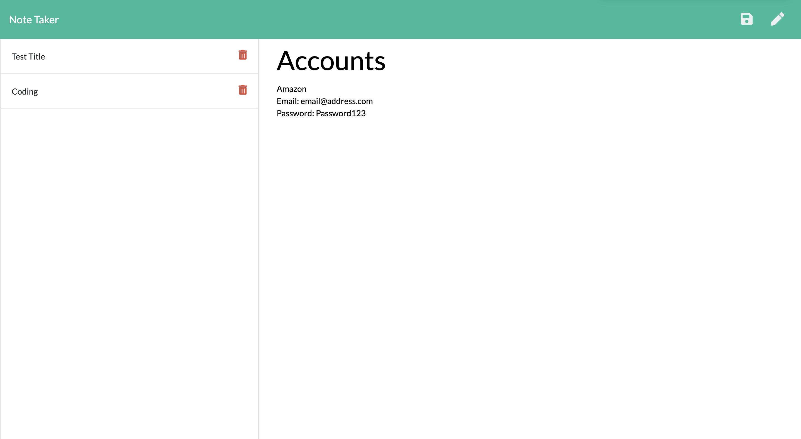
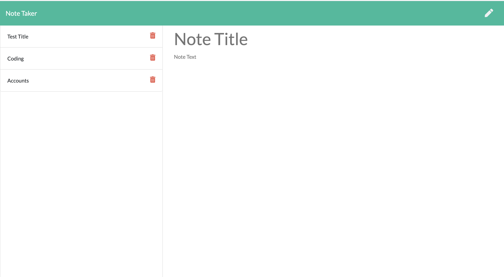

# Note_Taker

# Table of Contents

1. [Description](#Description)
2. [Installation](#Installation)
3. [Usage](#Usage)
4. [Test](#test)
5. [License](#License)
6. [Questions](#Questions)

## Description
The purpose of this is for user to write down notes and have them be saved if they were to close or end the session.  
   
This image shows an example of what can be written as a note.  
&nbsp&nbsp&nbsp&nbsp&nbsp&nbsp

This image shows what happens once saved. The textarea clears along with it appearing on the left-hand column.   

## Installation
You will need to have NPM Install package, and NPM Inquirer installed.
## Usage
AS a user, I want to be able to write and delete notes SO THAT I can be more organized and don't forget anything important
## Contributing
No contributors
## Test
There is a deployed link to test the program. No further installations is needed.
## License
MIT
## Questions
* Github: https://github.com/dvorav
* Email: d.vorav612@gmail.com